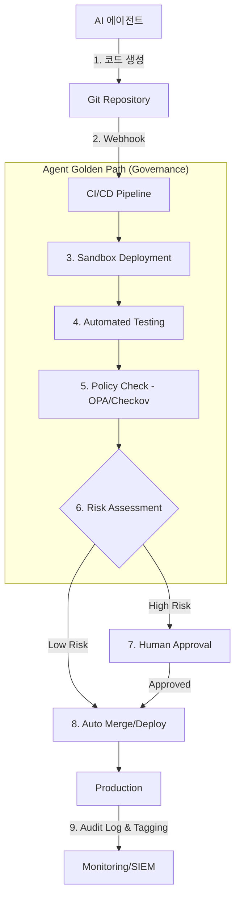

# [AI 에이전트 16편] Agentic Infrastructure — AI를 위한 인프라 거버넌스와 Golden Paths

&nbsp;

인프라 관리를 자동화하는 **AI 에이전트(Agentic AI)**가 플랫폼의 주요 사용자로 등장하고 있습니다. 사람이 CLI나 콘솔에서 수동으로 조작하던 시대를 지나, 이제 AI가 직접 Terraform 코드를 수정하고 Kubernetes Manifest를 배포하며 장애를 복구합니다.

&nbsp;

하지만 AI에게 인프라 제어권을 넘기는 것은 양날의 검입니다. 잘못된 아키텍처 변경이나 보안 설정 오류가 순식간에 서비스 전체를 마비시킬 수 있기 때문입니다. 이를 방어하기 위해 설계된 **'에이전트 골든 패스(Agent Golden Paths)'**와 거버넌스 전략을 심층적으로 다룹니다.

&nbsp;

&nbsp;

---

&nbsp;

## 1. Sandbox & Verification: 격리와 자동 검증

&nbsp;

AI 에이전트가 생성한 코드는 '잠재적 위험'으로 간주해야 합니다. 운영 환경에 바로 적용하는 것이 아니라, 반드시 격리된 단계별 검증 과정을 거쳐야 합니다.

&nbsp;

### 1-1. 격리된 샌드박스 (Isolated Sandbox)
에이전트가 코드를 작성하면, 실제 운영 환경과 유사하지만 물리적으로 완전히 분리된 샌드박스 환경(Episodic Infrastructure)이 동적으로 생성됩니다. 
- **Ephemeral Environments**: 에이전트의 변경 사항을 테스트하기 위해 잠깐 생성되었다가 검증 후 삭제되는 임시 환경입니다.
- **Data Masking**: 샌드박스에는 운영 데이터 대신 마스킹된 더미 데이터나 합성 데이터(Synthetic Data)를 제공하여 정보 유출을 원천 차단합니다.

&nbsp;

### 1-2. 정책 기반 자동 검증 (Policy-as-Code)
에이전트가 생성한 인프라 코드가 기업의 보안 정책과 아키텍처 표준을 준수하는지 기계가 검증합니다.
- **Dry-run & Plan**: `terraform plan`이나 `kubectl diff` 결과를 파싱하여 에이전트가 의도한 변경 범위를 정형화합니다.
- **OPA(Open Policy Agent) & Checkov**: "Public S3 Bucket 금지", "Root 권한 컨테이너 금지" 등의 룰셋을 통해 보안 취약점을 자동으로 필터링합니다. 만약 위반 시 에이전트에게 에러 메시지와 함께 수정을 재지시(Self-Correction)합니다.

&nbsp;

&nbsp;

---

&nbsp;

## 2. Identity & Quota: 에이전트 정체성과 제약

&nbsp;

AI 에이전트도 시스템 입장에서는 하나의 '사용자'입니다. 사람과 동일하게, 혹은 사람보다 더 엄격하게 관리되어야 합니다.

&nbsp;

### 2-1. 에이전트 개별 Identity 부여 (Machine Identity)
모든 에이전트에게 고유한 IAM(Identity and Access Management) 역할을 부여합니다.
- **Traceability**: 모든 변경 이력(CloudTrail, Audit Log)에 `PrincipalId`와 함께 `AI-generated: true`, `AgentID: DevOps-Junior-01`과 같은 메타데이터를 태깅합니다. 이는 사후 장애 분석(Post-mortem) 시 "누가 왜 이 변경을 했는가"를 명확히 하는 근거가 됩니다.
- **Least Privilege**: 에이전트에게는 해당 태스크 수행에 꼭 필요한 최소 권한만 부여합니다. 예를 들어 '네트워크 보안 그룹 수정' 에이전트는 DB 인스턴스를 삭제할 권한을 가져서는 안 됩니다.

&nbsp;

### 2-2. 리소스 및 비용 Quota 설정
AI의 실수(무한 루프 등)로 인한 리소스 낭비와 '비용 폭탄'을 방지하는 안전장치입니다.
- **Batch Limit**: 에이전트가 한 번의 PR(Pull Request)에서 변경할 수 있는 리소스의 최대 개수를 제한합니다.
- **Cost Guardrail**: 특정 에이전트 그룹에 할당된 월간 예산을 초과하거나, 한 번에 $1,000 이상의 비용 상승이 예상되는 변경 건은 자동으로 차단하고 사람의 승인을 요구합니다.

&nbsp;

&nbsp;

---

&nbsp;

## 3. Human-in-the-loop: 최종 승인 레이어

&nbsp;

완전 자동화(Full Automation)보다는 **'승인된 자동화'**가 기업용 인프라 관리의 핵심입니다.

&nbsp;

### 3-1. Critical Path 승인 프로세스
리소스의 중요도에 따라 승인 단계를 차등 설계합니다.
- **Low Risk**: 개발 환경의 인스턴스 타입 변경 등은 AI가 자동 수행 후 보고합니다.
- **High Risk**: 운영 환경의 DB 스키마 변경, 네트워크 라우팅 수정, 보안 정책 변경은 반드시 사람이 검토 후 승인 버튼을 눌러야 실행됩니다.

&nbsp;

### 3-2. 가독성 높은 리포트 (Reasoning Disclosure)
에이전트는 "코드를 고쳤습니다"라고 말하는 대신, **"왜 이 아키텍처를 선택했는지"**에 대한 근거를 사람에게 설명해야 합니다.
- **Reasoning**: "현재 트래픽 추이로 볼 때 2주 뒤 메모리 부족이 예상되어 인스턴스 사양을 상향 조정합니다."
- **Impact Analysis**: "이 변경으로 인해 예상되는 다운타임은 0초이며, 월 비용은 약 $50 증가합니다."

&nbsp;

&nbsp;

---

&nbsp;

## 4. 아키텍처 다이어그램: 에이전트 골든 패스

&nbsp;

&nbsp;

&nbsp;

---

&nbsp;

## 5. 요약 및 체크리스트

&nbsp;

| 전략 | 핵심 메커니즘 | 목적 |
|------|--------------|------|
| **Sandbox** | Ephemeral Environments | 운영 환경에 미치는 영향 차단 |
| **Verification** | Policy-as-Code (OPA) | 아키텍처 표준 및 보안 준수 |
| **Identity** | Agent-specific IAM Tags | 책임 소재 명확화 및 사후 추적 |
| **Quota** | Spending/Resource Limits | 비용 폭주 및 대규모 장애 방지 |
| **Human-in-the-loop** | Reasoning-based Approval | 최종 안정성 확보 및 인지적 신뢰 |

&nbsp;

**"AI 에이전트를 위한 인프라는 사람이 쓰는 인프라보다 더 정교한 가드레일이 필요합니다."**

에이전트 골든 패스는 AI가 자유롭게 역량을 발휘하면서도, 시스템의 전체적인 안정성을 해치지 않도록 만드는 최소한의 '안전 벨트'입니다.

&nbsp;

&nbsp;

---

&nbsp;

# 다음 편 예고

&nbsp;

> **[AI 에이전트 17편] Prompt Injection Defense — 에이전트를 가로채려는 공격을 어떻게 막을 것인가?**

&nbsp;

사용자의 입력값이 에이전트의 시스템 명령을 덮어쓰는 프롬프트 인젝션 공격의 실체와, 이를 방어하기 위한 계층적 방어 아키텍처(Input Sanitization, LLM Guardrails)를 다룹니다.

&nbsp;

&nbsp;

---

&nbsp;

&nbsp;

AI에이전트, AgenticInfrastructure, GoldenPath, 인프라거버넌스, MLOps, LLMOps, 보안가드레일, 자동화보안
