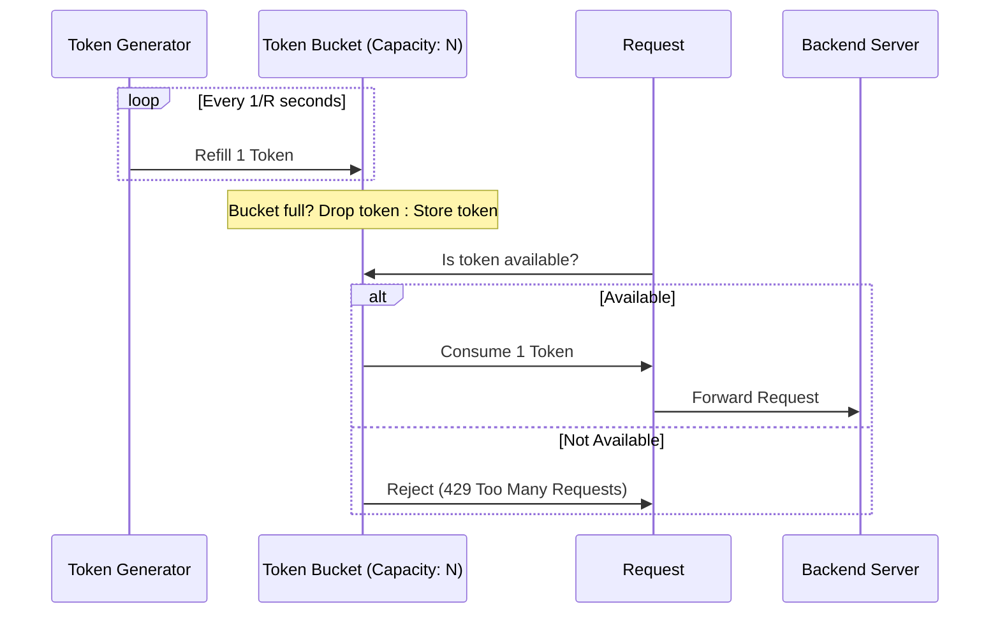
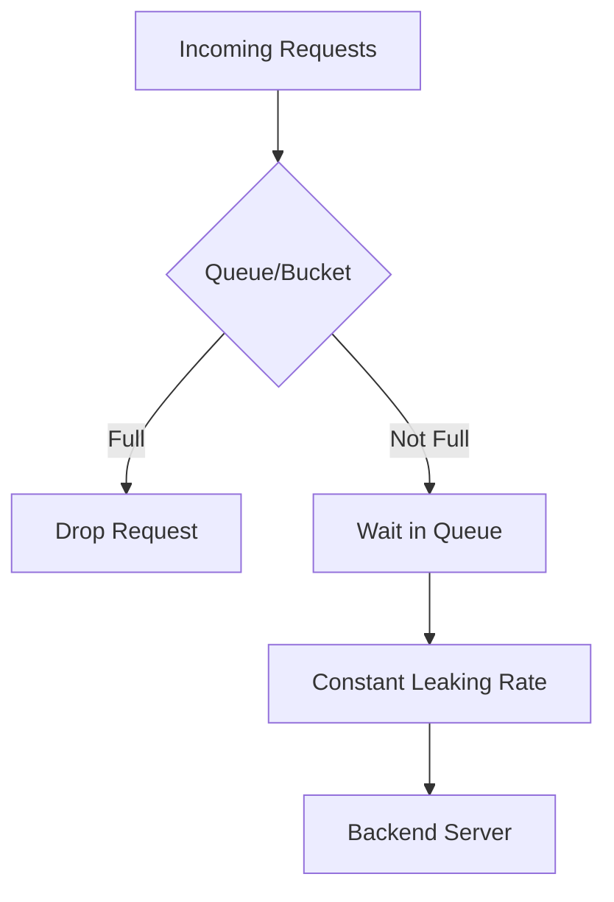

# [인프라 6편] 트래픽 제어 전략 — Rate Limiting 알고리즘 심층 분석

&nbsp;

고가용성 시스템에서 **Rate Limiting(처리율 제한)**은 단순히 요청을 막는 것이 아니라, 시스템의 가용 자원을 보호하고 특정 사용자의 자원 독점을 방지하여 전체적인 서비스 안정성을 유지하는 핵심 장치입니다. 특히 분산 환경에서 수만 명의 사용자가 동시에 접속할 때, 어떻게 시스템의 임계치를 초과하지 않으면서 우아하게 트래픽을 제어할 것인가에 대한 기술적 해답을 제시합니다.

&nbsp;

API Gateway 레이어에서 적용할 수 있는 주요 알고리즘의 작동 원리, 장단점, 그리고 시니어 엔지니어가 실무에서 마주하게 되는 복잡한 선택 기준을 심층적으로 분석합니다.

&nbsp;

&nbsp;

---

&nbsp;

## 1. Token Bucket (토큰 버킷): 유연성의 미학

토큰 버킷은 가장 널리 사용되는 알고리즘으로, 처리량의 평균값뿐만 아니라 일시적인 폭증(Burst)을 허용하는 유연함이 특징입니다.

### 1-1. 작동 메커니즘
1. 정해진 비율로 토큰이 버킷에 채워집니다 (예: 초당 10개).
2. 버킷에는 최대 용량이 정해져 있어, 꽉 차면 더 이상의 토큰은 소멸됩니다.
3. 요청이 들어오면 버킷에서 토큰을 하나 꺼내고 즉시 처리합니다.
4. 만약 버킷이 비어 있다면, 해당 요청은 폐기되거나 대기열에 담깁니다.

### 1-2. Mermaid 시각화: Token Bucket Flow


### 1-3. 실무적 인사이트
- **장점**: **Burst 트래픽 허용**. 버킷에 토큰이 100개 쌓여 있다면, 100개의 요청이 동시에 들어와도 즉시 처리가 가능합니다. 이는 일시적인 트래픽 급증이 잦은 사용자 지향적 서비스에 매우 적합합니다.
- **분산 환경의 문제**: Redis를 사용하여 구현할 때, 여러 인스턴스가 동시에 토큰을 소모하려 하면 Race Condition이 발생할 수 있습니다. 이를 위해 Redis의 `LUA Script`를 활용하여 원자적(Atomic) 연산을 보장해야 합니다.

&nbsp;

&nbsp;

---

&nbsp;

## 2. Leaky Bucket (유출 버킷): 엄격한 통제의 미학

유출 버킷은 트래픽의 유입 속도와 상관없이 백엔드에 전달되는 속도를 일정하게 강제합니다.

### 2-1. 작동 메커니즘
1. 요청이 들어오면 고정된 크기의 큐(Bucket)에 담깁니다.
2. 버킷 바닥에는 작은 구멍이 있어, 정해진 속도(Leaking Rate)로만 요청이 하나씩 빠져나갑니다.
3. 버킷이 가득 차면(큐가 꽉 차면) 새로 들어오는 요청은 즉시 폐기됩니다.

### 2-2. Mermaid 시각화: Leaky Bucket Flow


### 2-3. 실무적 인사이트
- **장점**: **Traffic Smoothing**. 백엔드로 전달되는 트래픽의 흐름이 매우 균일합니다. 데이터베이스 쓰기 작업이나 외부 서드파티 API(초당 호출 횟수가 엄격히 제한된)를 호출할 때 시스템을 보호하는 가장 강력한 수단입니다.
- **단점**: 버킷 크기가 작으면 Burst 트래픽 시 정상적인 요청도 많이 버려질 수 있어 사용자 경험이 저하될 수 있습니다.

&nbsp;

&nbsp;

---

&nbsp;

## 3. Window 기반 알고리즘: 시간의 경계

### 3-1. Fixed Window Counter
- **원리**: 1분, 1초 등 고정된 시간 윈도우별로 카운터를 둡니다.
- **문제점 (Boundary Problem)**: 윈도우의 끝(59초)과 다음 윈도우의 시작(01초)에 트래픽이 몰리면, 실제 허용된 수치의 2배에 달하는 부하가 짧은 시간에 가해질 수 있습니다.

### 3-2. Sliding Window Log/Counter
- **원리**: 고정된 구간이 아닌 현재 시점부터 과거 N분간의 기록을 실시간으로 계산합니다.
- **Mermaid 시각화: Sliding Window Counter**
```mermaid
graph LR
    subgraph "Previous Window (60%)"
        P[Prev Count: 100]
    end
    subgraph "Current Window (40%)"
        C[Curr Count: 20]
    end
    Note over P,C: Result = (Prev * 0.6) + Curr
```
- **실무 적용**: 정확한 할당량(Quota) 관리가 필요할 때 사용하며, 메모리 효율을 위해 통계적 가중치를 사용하는 Sliding Window Counter 방식이 선호됩니다.

&nbsp;

&nbsp;

---

&nbsp;

## 4. 분산 환경에서의 구현 (Distributed Rate Limiting)

단일 서버가 아닌 클러스터 환경에서는 Rate Limiting 상태를 공유해야 합니다.

### 4-1. Redis + Lua 스크립트 예시
분산 환경에서 Token Bucket을 원자적으로 구현하는 핵심 코드입니다.

```lua
-- Redis Lua Script
local key = KEYS[1]
local limit = tonumber(ARGV[1])
local current = tonumber(redis.call('get', key) or "0")

if current + 1 > limit then
    return 0 -- Reject
else
    redis.call("INCRBY", key, 1)
    redis.call("EXPIRE", key, 2) -- 2초 뒤 만료 (Window 설정)
    return 1 -- Accept
end
```

### 4-2. Global vs Local Rate Limiting
- **Global**: 모든 인스턴스가 공유하는 Redis 등을 사용. 정확하지만 네트워크 홉으로 인한 지연 시간이 발생합니다.
- **Local**: 각 인스턴스 메모리에서 처리. 매우 빠르지만 트래픽이 불균형하게 들어올 경우 특정 인스턴스에만 제약이 걸릴 수 있습니다.
- **추천**: API Gateway 레벨에서는 Global을, 서비스 내부 보호용으로는 Local을 사용하는 하이브리드 전략을 취합니다.

&nbsp;

&nbsp;

---

&nbsp;

## 5. 우아한 응답 처리 (HTTP 429)

Rate Limit에 걸린 사용자에게 단순히 에러를 던지는 것이 아니라, 다음에 언제 시도해야 할지 알려주는 배려가 필요합니다.

- **X-RateLimit-Limit**: 전체 허용량
- **X-RateLimit-Remaining**: 남은 요청 횟수
- **X-RateLimit-Reset**: 카운터가 초기화되는 시각
- **Retry-After**: 클라이언트가 재시도하기 전 대기해야 하는 시간(초 단위)

&nbsp;

&nbsp;

---

&nbsp;

## 6. 시니어 엔지니어의 선택 기준

어떤 알고리즘을 선택할 것인가는 **"무엇을 보호하고 싶은가"**에 달려 있습니다.

| 비즈니스 요구사항 | 추천 알고리즘 | 결정적 이유 |
|------|--------------|------|
| 일반적인 REST API 서비스 | **Token Bucket** | 일시적인 몰림을 허용하여 사용자 불편 최소화 |
| 금융 결제 또는 DB 쓰기 집약적 작업 | **Leaky Bucket** | 백엔드 시스템에 가해지는 부하를 물리적으로 평탄화 |
| 사내 내부 툴 할당량 관리 | **Fixed Window** | 구현의 단순함과 낮은 인프라 비용 |
| 정밀한 과금(SaaS Quota) 관리 | **Sliding Window** | 시간 경계에서의 오차를 허용하지 않음 |

&nbsp;

&nbsp;

---

&nbsp;

## 7. 실전 엔지니어링 교훈

1. **에러는 전파된다**: Rate Limiting이 실패(예: Redis 장애)했을 때의 대응 전략(Fail-Open/Fail-Close)을 반드시 세워야 합니다. 보통은 시스템 마비를 막기 위해 Fail-Open(제한 없이 허용)을 선택하고 별도 경고를 띄웁니다.
2. **비대칭적 비용**: 모든 API의 Rate Limit이 같을 필요는 없습니다. 단순 조회 API와 비싼 AI 추론 API는 서로 다른 버킷과 비용을 적용해야 합니다.
3. **클라이언트 사이드 제어**: 서버에서 429 에러를 받았다면 클라이언트(Mobile/Web)에서도 **Exponential Backoff**를 적용하여 서버의 부하를 덜어주는 구조가 수반되어야 진정한 고가용성 아키텍처라 할 수 있습니다.

&nbsp;

&nbsp;

---

&nbsp;

# 다음 편 예고

&nbsp;

> **[인프라 7편] 자원 최적화와 지능형 스케일링 — Right-sizing과 KEDA**

&nbsp;

트래픽 제어로 시스템을 보호했다면, 이제는 비용 효율적으로 자원을 사용할 차례입니다. CPU/메모리 사용량을 넘어 이벤트 기반으로 선제적으로 확장하는 KEDA의 실무 적용 전략과 리소스 라이트사이징 노하우를 다룹니다.

&nbsp;

---

&nbsp;
RateLimiting, APIGateway, TokenBucket, LeakyBucket, TrafficControl, 분산시스템보호, 인프라아키텍처
