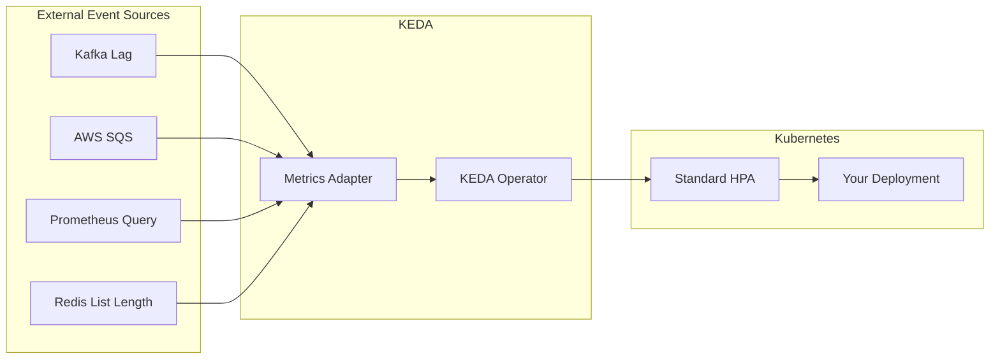

# [인프라 7편] 자원 최적화와 지능형 스케일링 — Right-sizing과 KEDA

&nbsp;

클라우드 네이티브 환경에서 비용 최적화는 단순히 '저렴한 서버를 쓰는 것'이 아닙니다. **'비즈니스 워크로드의 특성을 데이터로 이해하고, 그에 가장 적합한 자원을 할당하며, 수요에 따라 지능적으로 확장하는 것'**이 본질입니다. 특히 AI 워크로드와 대규모 트래픽 변동이 일상화된 현대의 인프라에서, 시니어 엔지니어가 반드시 갖춰야 할 리소스 라이트사이징(Right-sizing) 전략과 Kubernetes 기반의 지능형 오토스케일링 도구인 KEDA의 실무 적용법을 심층적으로 다룹니다.

&nbsp;

&nbsp;

---

&nbsp;

## 1. 리소스 라이트사이징 (Right-sizing) 전략

라이트사이징은 시스템의 안정성과 비용 효율성 사이에서 최적의 균형점(Sweet Spot)을 찾는 과정입니다.

### 1-1. 데이터 기반의 리소스 할당: 95th Percentile
평균 사용량(Average)에 속지 마십시오. 평균을 기준으로 자원을 할당하면 스파이크 발생 시 시스템이 즉시 무너집니다.
- **분석 방법**: CPU 및 메모리 사용량의 **95th Percentile(95퍼센타일)** 데이터를 기준으로 파드의 `Request`를 설정하고, `Limit`은 그보다 20~30% 여유 있게 잡습니다.
- **이유**: 이는 대부분의 트래픽 변동을 수용하면서도, 전체 가동 시간의 5% 미만인 극단적인 스파이크를 위해 과도한 비용을 지불하는 것을 방지합니다.

### 1-2. VPA (Vertical Pod Autoscaler)의 실무 적용
HPA가 파드의 개수를 늘린다면, VPA는 파드의 체급(사양)을 조절합니다.
- **Recommendation Mode**: 운영 환경에서 VPA를 `Auto` 모드로 두어 파드가 수시로 재시작되는 것은 위험합니다. 대신 `Initial` 또는 `Off` 모드로 설정하여 VPA가 제안하는 최적의 리소스 가이드라인을 데이터로 수집하고, 이를 바탕으로 정기적인 리소스 조정을 수행하는 것이 정석입니다.
- **Goldilocks 활용**: VPA의 추천 데이터를 대시보드로 시각화해 주는 오픈소스 도구를 활용하여, 어떤 네임스페이스가 자원을 낭비하고 있는지 한눈에 파악하십시오.

### 1-3. 인스턴스 패밀리 최적화
- **운영(Prod)**: 워크로드 성격에 따라 **C(Compute), M(General), R(Memory)** 타입을 명확히 구분하십시오. AI 추론은 C타입, 대규모 캐시는 R타입이 유리합니다.
- **개발(Dev)**: **T 타입(Burstable)** 인스턴스를 적극 활용하고, AWS 인스턴스 스케줄러를 통해 퇴근 시간 및 주말에는 리소스를 자동으로 중지하여 비용을 50% 이상 절감하십시오.

&nbsp;

&nbsp;

---

&nbsp;

## 2. Kubernetes 스케일링 노하우: HPA의 정석

표준 HPA(Horizontal Pod Autoscaler)를 제대로 설정하는 것만으로도 서비스 가용성의 90%를 확보할 수 있습니다.

### 2-1. 임계치 설정의 황금률 (Golden Threshold)
- **50~60%의 마법**: 많은 개발자가 임계치를 80%로 설정하는 실수를 범합니다. 하지만 CPU 사용량이 80%에 도달했을 때 스케일링이 시작되면, 신규 파드가 준비되는(Warm-up) 수십 초 동안 기존 파드가 부하를 견디지 못하고 쓰러지는 **Cascading Failure**가 발생합니다. 50~60%는 시스템이 안전하게 확장될 시간을 벌어주는 최소한의 방어선입니다.

### 2-2. Thrashing 방지: Stabilization Window
트래픽이 1분 단위로 요동칠 때 파드가 생성과 삭제를 반복하며 시스템에 부하를 주는 현상을 막아야 합니다.
- `scaleDown`의 `stabilizationWindowSeconds`를 300초(5분) 이상으로 설정하여, 트래픽이 완전히 안정화된 후에 자원을 회수하도록 설계하십시오.

&nbsp;

&nbsp;

---

&nbsp;

## 3. 지능형 스케일링의 정점: KEDA

HPA가 '불이 난 뒤에 물을 뿌리는 것'이라면, **KEDA(Kubernetes Event-driven Autoscaling)**는 '연기가 나기 시작할 때 이미 대처하는 것'입니다.

### 3-1. KEDA 아키텍처와 작동 원리
KEDA는 표준 HPA 위에 올라가는 오케스트레이터로, CPU/메모리가 아닌 **외부 이벤트 소스**를 직접 감시합니다.

### 3-2. 핵심 스케일러(Scalers) 활용 사례
1. **Kafka / RabbitMQ Scaler**: 메시지 큐의 **Consumer Lag**을 기준으로 스케일링합니다. 작업량이 쌓이는 즉시 일손을 늘리므로 응답 지연 시간을 최소화합니다.
2. **Prometheus Scaler**: 비즈니스 메트릭(예: 초당 결제 건수, 특정 API 에러율)을 쿼리하여 스케일링 조건으로 사용합니다.
3. **Cron Scaler**: 매일 오전 9시처럼 트래픽 급증이 명확히 예상되는 시점에 미리 파드를 늘려놓는 **Pre-scaling**을 수행합니다.

### 3-3. Zero-scaling (Scale to Zero)
KEDA의 가장 강력한 기능은 요청이 전혀 없을 때 파드를 0개로 줄일 수 있다는 점입니다.
- 이벤트가 발생하면 KEDA가 즉시 파드를 1개로 살려내고, 이후 제어권을 표준 HPA에 넘깁니다. 이는 사내 배치 작업이나 간헐적 워크로드의 비용을 **Zero**로 수렴하게 만듭니다.

&nbsp;

&nbsp;

---

&nbsp;

## 4. 실전 엔지니어링 교훈: 오토스케일링의 함정

1. **리소스 부족(Resource Starvation)**: HPA로 파드는 늘어났는데, 정작 이를 수용할 워커 노드(EC2)가 부족하면 소용없습니다. **Cluster Autoscaler** 또는 **Karpenter**와 HPA/KEDA를 반드시 연동하여 인프라 전체가 유기적으로 확장되도록 설계하십시오.
2. **의존성 시스템 부하**: 내 서비스는 100개로 늘어났는데, 연결된 데이터베이스(DB)나 서드파티 API가 그 부하를 견디지 못하면 전체 시스템이 마비됩니다. 스케일링의 `maxReplicas`는 반드시 하부 시스템의 한계를 고려하여 설정해야 합니다.
3. **Startup Latency**: 파드가 뜨는 데 2분이 걸린다면 어떤 오토스케일링도 무용지물입니다. 이미지 크기 최적화, JVM Warm-up 시간 단축 등을 통해 **Time-to-Ready**를 최소화하는 노력이 병행되어야 합니다.

&nbsp;

&nbsp;

---

&nbsp;

## 5. 시니어의 시각: 아키텍처적 결론

현대적인 클라우드 아키텍처에서 자원 최적화는 다음과 같은 우선순위를 가져야 합니다.
- **1순위**: **KEDA**를 통한 이벤트 기반 선제적 확장 (특히 메시지 기반 시스템에서 필수).
- **2순위**: **HPA**를 통한 시스템 안정성 보루 (CPU/메모리 기반).
- **3순위**: 정기적인 **95th Percentile** 데이터 분석을 통한 **Right-sizing** 수행.

비용을 줄이는 것은 단순히 돈을 아끼는 것이 아니라, **비즈니스가 더 건강하게 성장할 수 있는 기술적 체력을 기르는 것**입니다.

&nbsp;

&nbsp;

---

&nbsp;

# 다음 편 예고

&nbsp;

> **[인프라 8편] Sidecarless 아키텍처 — 왜 서비스 메시는 Sidecar를 버리고 Ambient Mesh로 진화하는가?**

&nbsp;

자원 최적화까지 마쳤다면, 이제는 복잡하게 얽힌 서비스 간의 통신을 효율적으로 관리할 차례입니다. 모든 Pod에 프록시를 띄우는 기존 방식의 한계를 넘어, 성능과 운영 효율을 극대화하는 Ambient Mesh의 실체를 파헤칩니다.

&nbsp;

---

&nbsp;
RightSizing, KEDA, HPA, Kubernetes, 비용최적화, 오토스케일링, 인프라설계, FinOps
