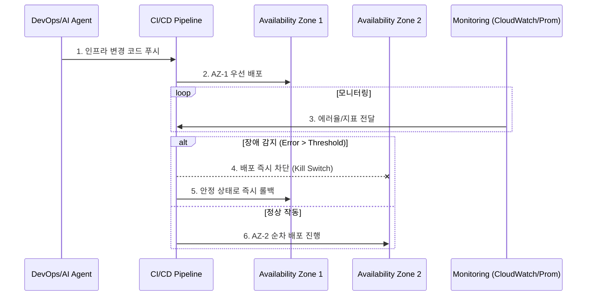

# [인프라 14편] 리전 장애와 연쇄적 붕괴 방지 — 클라우드의 물리적 한계를 극복하는 설계 전략

&nbsp;

"클라우드는 절대 죽지 않는다"는 믿음은 환상에 가깝습니다. 2026년 현재, 특정 리전 전체가 마비되거나 관리형 서비스(API)의 배포 오류로 인해 프로비저닝이 불가능해지는 사례는 여전히 발생하고 있습니다. 특히 최근 발생한 주요 하이퍼스케일러의 리전 장애는 한 지점의 오류가 어떻게 전체 시스템으로 전파되는지를 보여주는 뼈아픈 교훈을 남겼습니다.

&nbsp;

본 글에서는 리전 단위의 장애를 방어하기 위한 **'에이전트 골든 패스(Agent Golden Paths)'**와 **'연쇄적 장애(Cascading Failure)'** 방지 전략, 그리고 GPU 인프라의 새로운 대안으로 떠오르는 **니오클라우드(Neocloud)** 환경에서의 데이터 설계법을 시니어 엔지니어의 관점에서 심층 분석합니다.

&nbsp;

&nbsp;

---

&nbsp;

## 1. 리전 장애 대응: Blast Radius 제어와 격리 아키텍처

&nbsp;

리전 전체의 장애는 보통 인프라 설정의 잘못된 변경이 전 리전으로 동시 전파될 때 발생합니다. 이를 막기 위한 핵심은 '영향 범위(Blast Radius)'를 물리적으로 쪼개는 것입니다.

&nbsp;

### 1-1. AZ 단위 순차 배포 (Staged Rollout)
모든 가용 영역(AZ)에 한 번에 설정을 적용하는 '빅뱅 배포'는 금물입니다. 
- **단계별 가드레일**: 인프라 파이프라인에서 AZ-1에 먼저 변경 사항을 적용하고, 5~10분간 에러율과 Latency를 모니터링합니다. 임계치를 넘으면 즉시 나머지 AZ로의 전파를 차단하는 **자동 중단 스위치(Circuit Breaker for Infra)**가 작동해야 합니다.
- **IaC Drift 방지**: 테라폼(Terraform) 등의 코드가 실제 리소스와 일치하지 않는 '드리프트' 상태에서 긴급 복구를 시도하면 장애가 가중됩니다. 정기적인 드리프트 체크와 자동 복구 워크플로우가 필수적입니다.

&nbsp;

### 1-2. 프로비저닝 격리와 Warm Standby
클라우드 제공업체의 Control Plane(API)이 마비되면 신규 서버 증설이 불가능해집니다.
- **Over-provisioning**: 평상시 피크 트래픽의 1.2배 수준으로 자원을 미리 확보해 두는 전략입니다. 장애 시 API 호출 없이도 즉시 부하를 견딜 수 있습니다.
- **Pilot Light / Warm Standby**: 타 리전(DR)에 최소 사양의 데이터베이스와 핵심 서비스를 항상 기동해 둡니다. 장애 발생 시 DNS 수준에서 트래픽을 절체(Failover)하여 RTO(복구 목표 시간)를 수 초 단위로 단축합니다.

&nbsp;

### 1-3. Mermaid 시각화: 리전 장애 차단 흐름도

&nbsp;

&nbsp;

---

&nbsp;

## 2. Neocloud와 AI 인프라: 하이브리드 GPU 전략

&nbsp;

2026년 인프라의 가장 큰 화두는 CoreWeave나 Lambda 같은 **니오클라우드(Neocloud)**의 부상입니다. 하이퍼스케일러보다 GPU 가용성이 높고 저렴하지만, 기존 인프라와의 통합이 과제입니다.

&nbsp;

### 2-1. 데이터 중력(Data Gravity) 문제 해결
모든 데이터를 니오클라우드로 옮기는 것은 비용과 시간 면에서 불가능합니다.
- **하이브리드 배치**: 연산 집약적인 LLM 추론/학습 워크로드만 니오클라우드로 보내고, 정형 데이터(DB)와 비즈니스 로직은 기존 클라우드(AWS/Azure 등)에 유지합니다.
- **저지연 백본 구축**: 공용 인터넷 대신 Equinix나 Megaport 같은 중립 IDC를 통해 두 클라우드 간 **Private Direct Connect**를 구성합니다. 이를 통해 리전 간 통신 지연을 10ms 이내로 묶고 이그레스(Egress) 비용을 획기적으로 낮춥니다.

&nbsp;

### 2-2. AI 유닛 이코노믹스 (Unit Economics)
단순 총액 관리가 아닌, '비즈니스 가치당 비용'을 측정해야 합니다.
- **토큰당 비용 측정**: API Gateway 레이어에서 사용자 ID별 소모 토큰량을 트래킹하고, 이를 실시간 GPU 컴퓨팅 비용과 결합하여 '요청 1건당 순이익'을 대시보드화합니다.
- **동적 라우팅**: 복잡한 추론은 고가의 H100 클러스터로, 간단한 요약은 저렴한 SLM(Small Language Models)이나 전용 가속기(Inferentia)로 실시간 분기하여 원가를 절감합니다.

&nbsp;

&nbsp;

---

&nbsp;

## 3. Kubernetes v1.37+ 혁신: In-Place Vertical Scaling

&nbsp;

과거에는 파드의 리소스(CPU/Mem)를 바꾸려면 파드를 죽이고 새로 띄워야 했습니다. 이제는 재시작 없는 확장이 가능해졌습니다.

&nbsp;

### 3-1. HPA와 In-Place Scaling의 충돌 방지
- **역할 분리**: HPA는 트래픽 폭증에 대응하는 '수평 확장'에 집중하고, In-Place Scaling은 개별 파드의 미세한 성능 튜닝(Vertical)에 집중하도록 설계합니다.
- **충돌 방지 로직**: VPA(Vertical Pod Autoscaler)가 파드 크기를 키우려 할 때, HPA가 파드 개수를 줄이려 하면 시스템이 진동(Flapping)합니다. 이를 방지하기 위해 VPA는 '권장(Recommendation)' 모드로 운영하고, 실제 조정은 특정 안정화 윈도우를 거친 후 수행되도록 가드레일을 둡니다.

&nbsp;

### 3-2. 공급망 보안 (Supply Chain Security)
Axios NPM 사고와 같은 공격으로부터 인프라를 보호해야 합니다.
- **SBOM(Software Bill of Materials)**: 모든 배포 아티팩트에 대해 소프트웨어 명세서를 자동 생성하고, 취약점(CVE) 스캔을 거치지 않은 패키지는 배포 단계에서 원천 차단합니다.
- **Egress Zero Trust**: 컨테이너가 실행되는 동안 허용되지 않은 외부 IP(공격자 C2 서버 등)로의 모든 통신을 기본 차단(`Deny-all`)하는 네트워크 정책(NetworkPolicy)을 강제합니다.

&nbsp;

&nbsp;

---

&nbsp;

## 4. 실전 엔지니어링 교훈: 복원력은 문화에서 나온다

&nbsp;

1. **장애는 '언제'의 문제이지 '만약'의 문제가 아니다**: 시니어 엔지니어는 시스템이 반드시 죽을 것이라고 가정하고 설계를 시작해야 합니다.
2. **기술 부채를 비즈니스 언어로 번역하라**: "리팩토링이 필요합니다"라고 말하지 마십시오. "이 모듈의 복잡도 때문에 신규 기능 추가 시 장애 확률이 20% 높고, 복구 시간이 2배 더 걸립니다"라고 PO에게 숫자로 소통하십시오.
3. **자동화되지 않은 복구는 복구가 아니다**: 장애 상황에서 사람이 타이핑하는 모든 명령은 오류의 가능성을 품고 있습니다. 모든 복구 시나리오는 사전에 IaC와 스크립트로 준비되어 있어야 하며, 카오스 엔지니어링을 통해 매달 '예방 접종'을 받아야 합니다.

&nbsp;

&nbsp;

&nbsp;

&nbsp;

---

# 다음 편 예고

&nbsp;

> **[인프라 15편] FinOps 2.0 — 클라우드 비용 효율화를 넘어선 'AI 수익성 아키텍처' 설계**

&nbsp;

클라우드 비용을 줄이는 시대를 넘어, 이제는 AI 기능이 실제 비즈니스 수익에 기여하는지를 실시간으로 측정해야 합니다. 토큰 이코노믹스와 컴퓨팅 자원을 결합한 차세대 FinOps 체계와 실시간 비용 모니터링 시스템 구축법을 다룹니다.

&nbsp;

---

&nbsp;

RegionalOutage, CascadingFailure, Neocloud, AIUnitEconomics, K8sScaling, SupplyChainSecurity, Resilience
